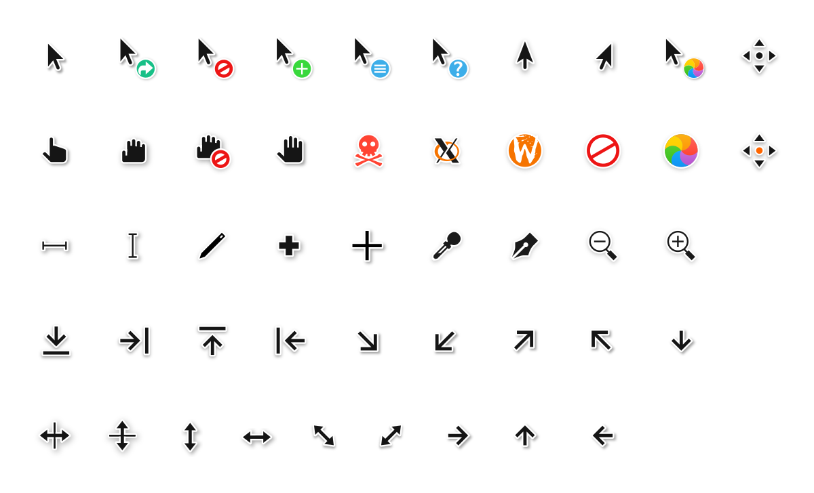

# McMojave cursors
This is an x-cursor theme inspired by macOS and based on KDE Breeze.


## Installation
To install the cursor theme simply copy the compiled theme to your icons
directory. For local user installation:

```
cp -pr dist/ ~/.icons/McMojave-cursors
```

For system-wide installation for all users:

```
sudo cp -pr dist/ /usr/share/icons/McMojave-cursors
```

Then set the theme with your preferred desktop tools.

## Building from source
You'll find everything you need to build and modify this cursor set in
the `src/` directory. To build the xcursor theme from the SVG source
run:

```
./build.sh
```

This will generate the pixmaps and appropriate aliases.
The freshly compiled cursor theme will be located in `dist/`

## Preview

